# K8s Jenkins SonarQube CI/CD Pipeline

A production-style CI/CD pipeline that builds, security-scans, and deploys a Node.js application to a self-managed Kubernetes cluster (Kubespray) using Jenkins, SonarQube, Gitleaks, OWASP Dependency-Check, Trivy, and Amazon ECR.

The pipeline enforces **quality and security gates** — it fails fast if code quality, secrets, dependency vulnerabilities, or container image vulnerabilities don't meet the defined thresholds, and only deploys once every gate passes.

---

## Architecture

```
Developer Push (GitHub)
        │
        ▼
   Jenkins Pipeline
        │
   ┌────┴─────────────────────────────────────────────┐
   │  1. Checkout (SCM)                               │
   │  2. Gitleaks — Secret Detection                  │
   │  3. Install Dependencies (npm install)           │
   │  4. SonarQube — Static Code Analysis             │
   │  5. SonarQube — Quality Gate                     │
   │  6. OWASP Dependency-Check (CVSS threshold)      │
   │  7. Docker Build                                 │
   │  8. Trivy — Container Image Scan                 │
   │  9. Login & Push Image → Amazon ECR              │
   │ 10. Deploy → Kubespray Cluster (Rolling Update)  │
   │ 11. Verify Rollout Status                        │
   └──────────────────────────────────────────────────┘
        │
        ▼
Self-Managed Kubernetes Cluster (Kubespray)
   master (control-plane) + worker1
        │
        ▼
  App exposed via NodePort Service
```

---

## Tech Stack

| Category            | Tool                                   |
|----------------------|-----------------------------------------|
| CI/CD Orchestration  | Jenkins (Declarative Pipeline)          |
| Source Control       | GitHub                                  |
| Secret Detection     | Gitleaks                                |
| Code Quality         | SonarQube (Static Analysis + Quality Gate) |
| Dependency Scanning  | OWASP Dependency-Check                  |
| Container Scanning   | Trivy                                   |
| Containerization     | Docker                                  |
| Image Registry       | Amazon ECR                              |
| Orchestration        | Kubernetes (self-managed via Kubespray) |
| App Runtime          | Node.js                                 |

---

## Pipeline Stages

### 1. Checkout
Pulls the latest source from GitHub.

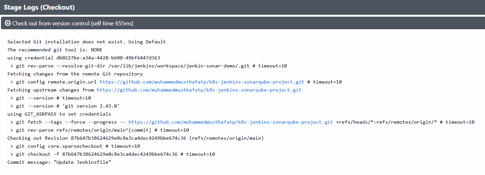

### 2. Secret Detection — Gitleaks
Scans the full commit history for hardcoded credentials, API keys, and tokens before any further processing. Build stops immediately if a leak is found.

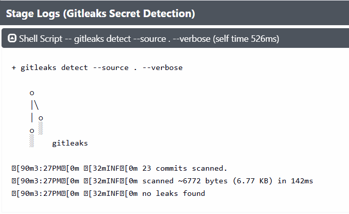

### 3. Install Dependencies
Installs Node.js dependencies and runs a preliminary `npm audit`.


### 4 & 5. SonarQube Analysis + Quality Gate
Runs static analysis against the SonarQube server and blocks the pipeline (`waitForQualityGate abortPipeline: true`) if the project doesn't meet the configured quality thresholds (bugs, code smells, coverage, duplications).

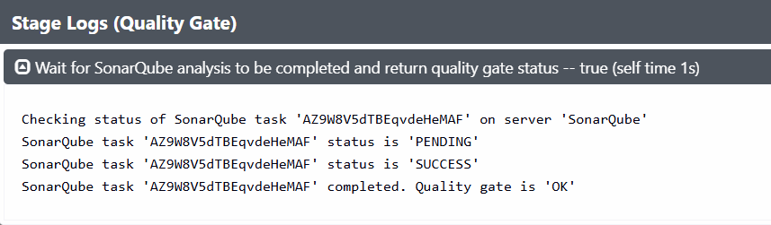

The project's overall SonarQube dashboard confirms a **Passed** Quality Gate — 0 Bugs, 0 Vulnerabilities, 100% Hotspots Reviewed, 0 Code Smells:

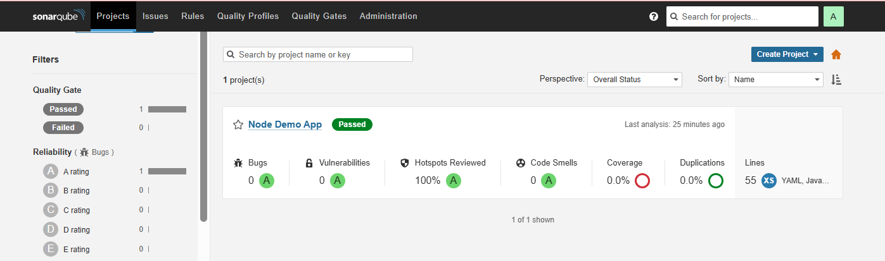

### 6. OWASP Dependency-Check
Scans project dependencies for known CVEs and fails the build if any dependency exceeds the configured CVSS score threshold (`--failOnCVSS 7`).

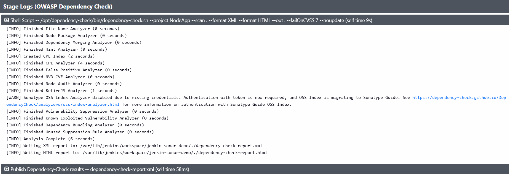
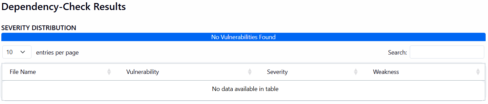

### 7. Build Docker Image
Builds the Node.js application image from the `Dockerfile`.

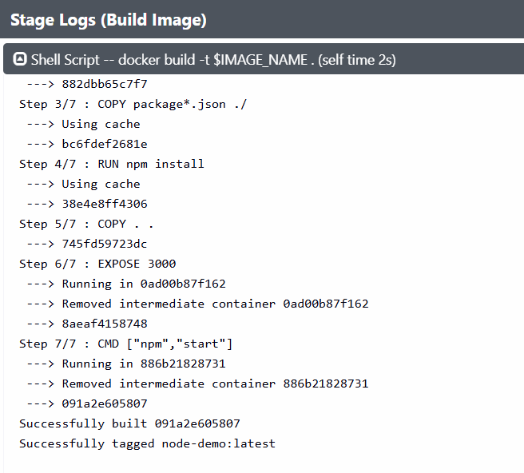

### 8. Trivy — Container Image Scan
Scans the built image for OS and library-level CRITICAL/HIGH vulnerabilities before it's allowed to reach the registry. In this run, Trivy flagged a `HIGH` severity finding, `CVE-2026-31802`, a symlink-traversal file-overwrite issue in the `tar` package (fixed in `7.5.11`) — demonstrating the scan is actually detecting real, current CVEs rather than passing silently.

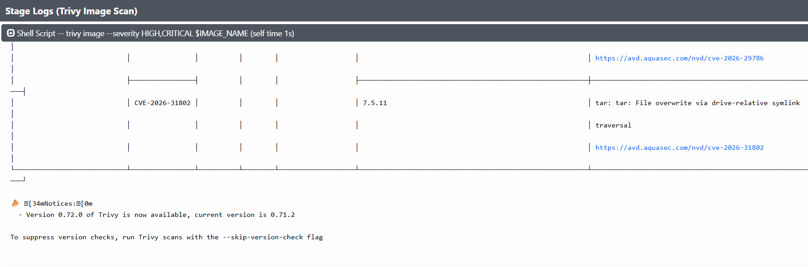

### 9. Login & Push to Amazon ECR
Authenticates to ECR and pushes the tagged image (tag = Jenkins `BUILD_NUMBER`).

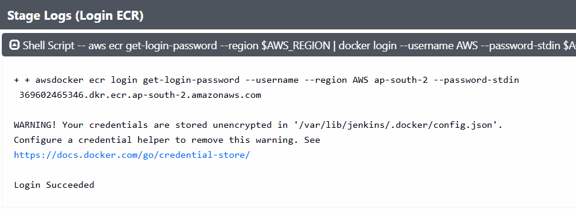
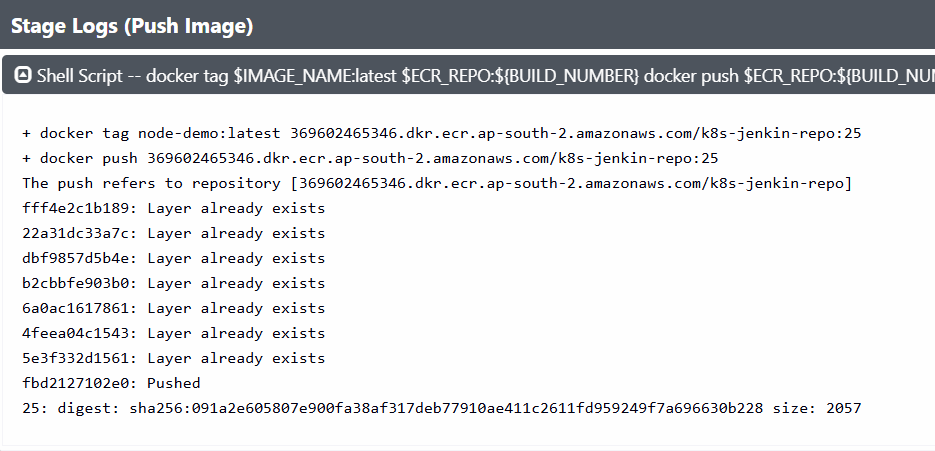
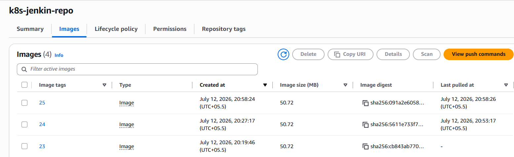

### 10. Deploy to Kubespray Cluster
Applies namespace, deployment, and service manifests, then updates the deployment image and triggers a **rolling restart** — zero downtime, old pods only terminate once new pods are healthy.

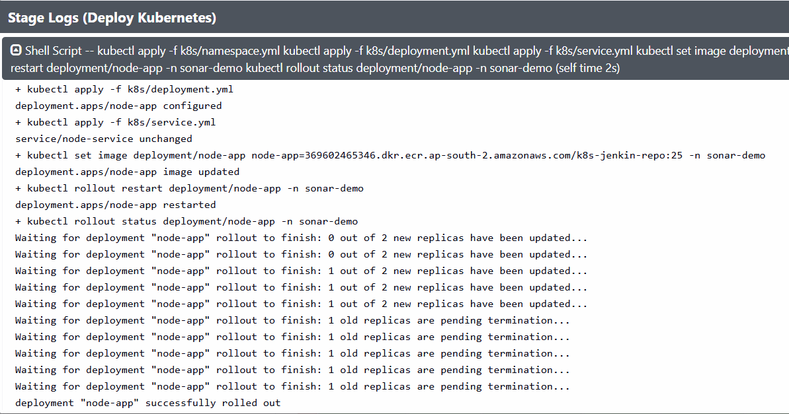

### 11. Verify Rollout
Confirms the rollout completed successfully and that all pods are `Running` on the cluster.

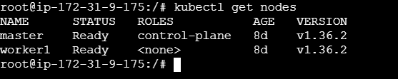
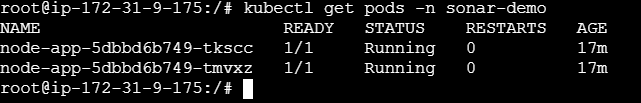
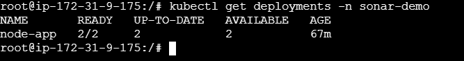
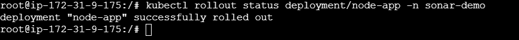

---

## Result

The application is successfully deployed and reachable via the cluster's NodePort service:

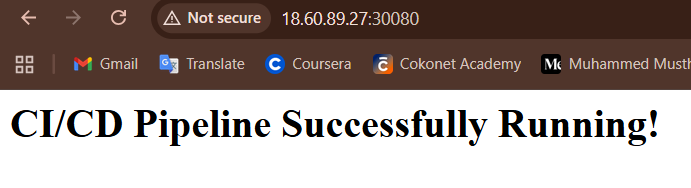

---

## Quality & Security Gates

| Check                  | Tool                  | Failure Condition                          |
|--------------------------|------------------------|---------------------------------------------|
| Hardcoded secrets       | Gitleaks               | Any secret detected                          |
| Code quality             | SonarQube               | Quality Gate status ≠ `OK`                   |
| Dependency vulnerabilities | OWASP Dependency-Check | Any dependency with CVSS score ≥ 7           |
| Container vulnerabilities | Trivy                  | Any `CRITICAL` or `HIGH` severity finding    |
| Deployment health         | kubectl rollout status | Rollout does not complete within timeout — auto rollback |

---

## Repository Structure

```
.
├── Jenkinsfile                # Declarative pipeline: build, scan, deploy stages
├── Dockerfile                 # Node.js application image
├── k8s/
│   ├── namespace.yml
│   ├── deployment.yml         # RollingUpdate strategy
│   └── service.yml            # NodePort service
├── src/                       # Application source code
├── package.json
└── screenshots/                # Pipeline execution evidence
```

---

## Cluster Setup

The Kubernetes cluster is self-managed and was provisioned using **Kubespray** on AWS EC2 (Ubuntu 24.04, containerd runtime, Calico CNI):

```
NAME      STATUS   ROLES           AGE   VERSION
master    Ready    control-plane   8d    v1.36.2
worker1   Ready    <none>          8d    v1.36.2
```

---

## Prerequisites

1. Jenkins with **SonarQube Scanner** and **OWASP Dependency-Check** plugins installed
2. SonarQube server configured under *Manage Jenkins → System*
3. Dependency-Check tool configured under *Manage Jenkins → Tools*
4. Gitleaks and Trivy available on the Jenkins agent (binary or Docker)
5. Jenkins credentials configured:
   - AWS credentials / IAM role with ECR push access
   - SonarQube auth token
   - kubeconfig for the Kubespray cluster
6. `kubectl` configured on the Jenkins agent with access to the cluster

---

## Author

**Muhammed Musthafa Thazhath Palangat**
Systems Engineer transitioning into DevOps | AWS · Kubernetes · Jenkins · Docker

[GitHub Repository](https://github.com/muhammedmusthafatp/k8s-jenkins-sonarqube-project)
